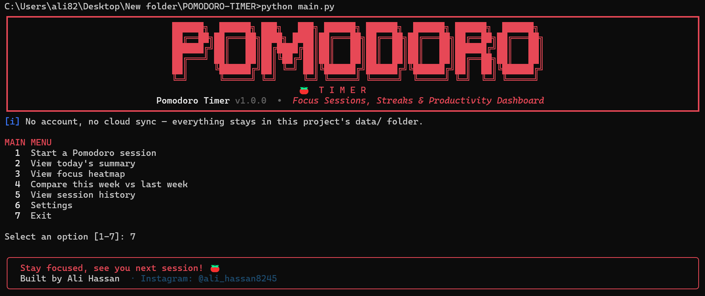
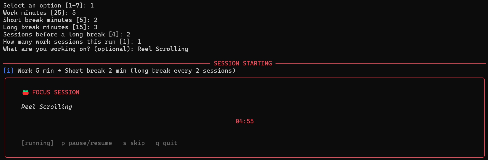
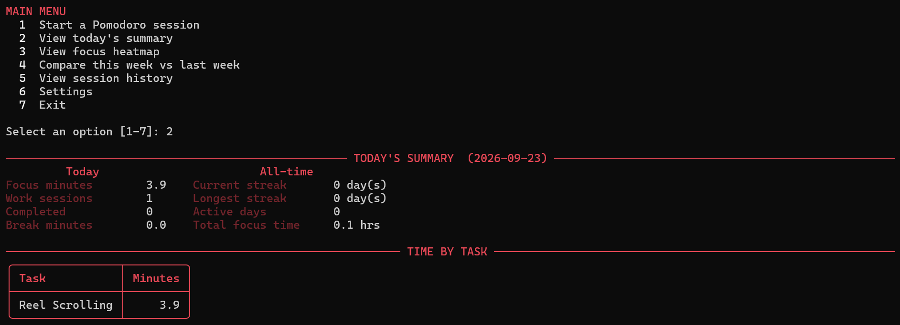
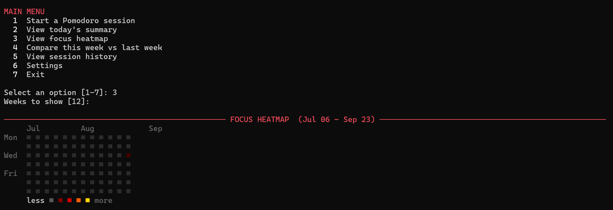
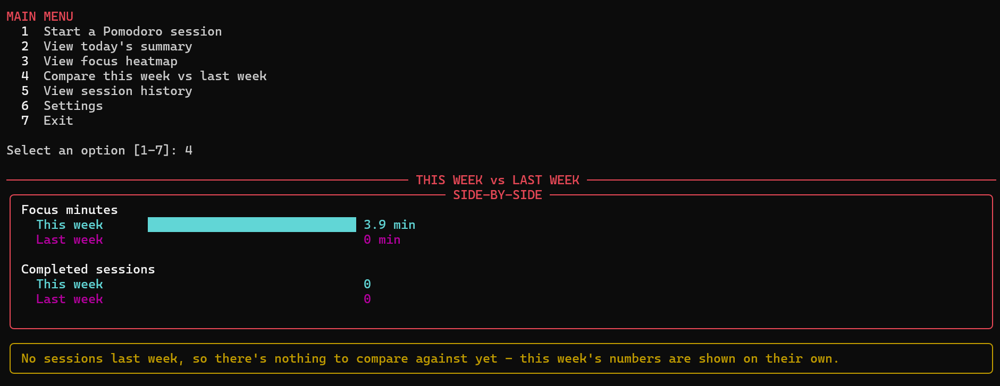

# Pomodoro Timer

A professional command-line focus timer that lives entirely on your machine —
live countdown, pause/skip/quit controls, real Windows toast notifications,
a GitHub-style focus heatmap, streaks, and week-over-week trend comparison.

No account. No cloud sync. No server. Every session is logged to a plain
JSON file inside this project's own `data/` folder.

<!-- SCREENSHOT 1 — BANNER + MAIN MENU
     Run: python main.py -->



---

## Features

- **Live countdown timer** with real keyboard controls while it's running —
  `p` pause/resume, `s` skip, `q` quit (progress so far is still saved)
- **Real Windows toast notifications** when a phase ends, with a terminal
  alert + bell fallback on any other platform
- **Daily summary** — focus minutes, sessions, breaks, time by task
- **Streaks** — current and longest run of consecutive active days
- **Focus heatmap** — a GitHub-contribution-style calendar in your terminal
- **This week vs last week** — a side-by-side comparison with a trend
  verdict (up/down/flat), or an honest "nothing to compare yet" message if
  either week has no sessions
- **Session history** — every session logged, planned vs. actual duration
- **Persisted settings** — save your preferred durations once, reused forever

---

## Requirements

Python 3.9+ and nothing else — no account, no API key, fully offline.

---

## Installation

```bash
git clone https://github.com/alihassanazad8245/POMODORO-TIMER.git
cd POMODORO-TIMER
python -m venv .venv
```

**Windows:** `.venv\Scripts\activate`
**Linux / macOS:** `source .venv/bin/activate`

```bash
pip install -r requirements.txt
python main.py
```

---

## Usage

### Interactive mode

```bash
python main.py
```

```
1  Start a Pomodoro session
2  View today's summary
3  View focus heatmap
4  Compare this week vs last week
5  View session history
6  Settings
7  Exit
```

### Direct mode

```bash
python main.py --start --label "Write report"
python main.py --start --work 50 --short-break 10 --cycles 3
python main.py --set-defaults --work 50 --short-break 10 --cycles 3
python main.py --summary
python main.py --heatmap --weeks 16
python main.py --compare
python main.py --history --limit 20
```

| Option | Description |
| --- | --- |
| `--start` | Start a session |
| `--summary` | Today's focus summary |
| `--heatmap` | Focus heatmap (`--weeks N`) |
| `--compare` | This week vs last week |
| `--history` | Recent sessions (`--limit N`) |
| `--set-defaults` | Save `--work`/`--short-break`/`--long-break`/`--cycles` |
| `--label TEXT` | What you're working on |
| `--sessions N` | Work sessions to run this invocation |
| `--no-color` | Disable coloured output |

### Timer controls (while running)

| Key | Action |
| --- | --- |
| `p` | Pause / resume |
| `s` | Skip the current phase |
| `q` | Quit the session |

---

## Windows notifications

A real Windows toast fires when a phase ends, via `winotify` — installed
automatically on Windows only (`requirements.txt` uses an environment
marker, so it's skipped entirely on Linux/macOS). If a toast can't be shown
for any reason, the app falls back to a terminal alert + bell instead.

---

## Screenshots

### Live timer

<!-- SCREENSHOT 2 — Run: python main.py --start --label "Deep work"
     Capture the live countdown mid-session. -->



### Daily summary

<!-- SCREENSHOT 3 — Run: python main.py --summary -->



### Focus heatmap

<!-- SCREENSHOT 4 — Run: python main.py --heatmap -->



### Week comparison

<!-- SCREENSHOT 5 — Run: python main.py --compare (after at least a few sessions) -->



---

## How your data is stored

```
data/
    sessions.json    # every session you've run
    config.json      # your saved default durations
```

Plain, human-readable JSON — inspect, back up, or edit it directly. Writes
are atomic, so an interrupted write can never corrupt your log. `data/*.json`
is git-ignored, so your personal history never gets committed.

---

## Project structure

```
POMODORO-TIMER/
├── main.py
├── requirements.txt
├── pytest.ini
├── README.md
├── LICENSE
├── data/                    # your session log (git-ignored)
├── tests/test_pomodoro.py
└── pomodoro_timer/
    ├── cli.py               # arguments, menu, orchestration
    ├── config.py            # defaults, paths, bounds
    ├── timer.py             # live countdown + pause/skip/quit
    ├── keyboard.py          # cross-platform key polling
    ├── notifier.py          # Windows toast + fallback
    ├── stats.py             # summary, streaks, heatmap, week comparison
    ├── storage.py           # atomic JSON read/write
    ├── models.py            # data structures
    ├── ui.py                # terminal rendering
    ├── errors.py
    └── utils.py
```

---

## Tests

```bash
pip install pytest
pytest
```

32 offline tests — storage round-trips, streaks, heatmap placement, week
comparison (including the no-data and new-data edge cases), the timer's
pause/skip/quit behaviour, and CLI argument parsing.

---

## Troubleshooting

- **No module named 'rich'** — run `pip install -r requirements.txt`
- **`p`/`s`/`q` don't respond** — needs a real interactive terminal; piped
  input disables keyboard control automatically (the timer still runs fine)
- **No toast on Windows** — check `pip show winotify` and that Windows
  notifications are enabled in Settings
- **Heatmap looks empty** — it only counts work sessions, not breaks; check
  `--history` to confirm sessions are being logged

---

## Limitations

- Real OS toasts are Windows-only; other platforms get a terminal alert
- Keyboard controls need a real terminal (harmless no-op otherwise)
- Single-machine only — history isn't synced anywhere; back up
  `data/sessions.json` yourself if you switch machines

---

## License

MIT License. See [LICENSE](LICENSE).

---

Built by **Ali Hassan** — [GitHub](https://github.com/alihassanazad8245) ·
[Instagram](https://instagram.com/ali_hassan8245)
